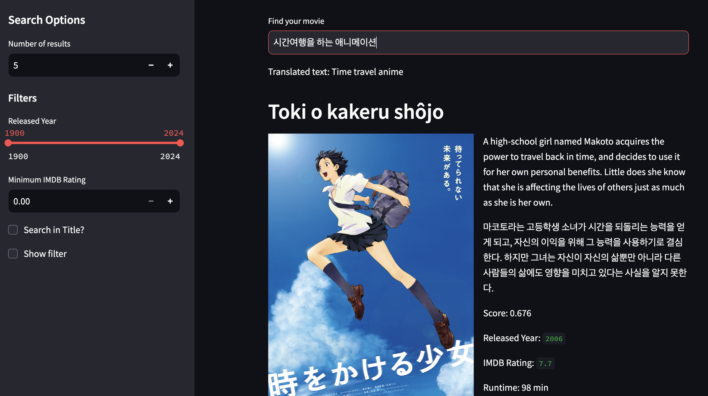
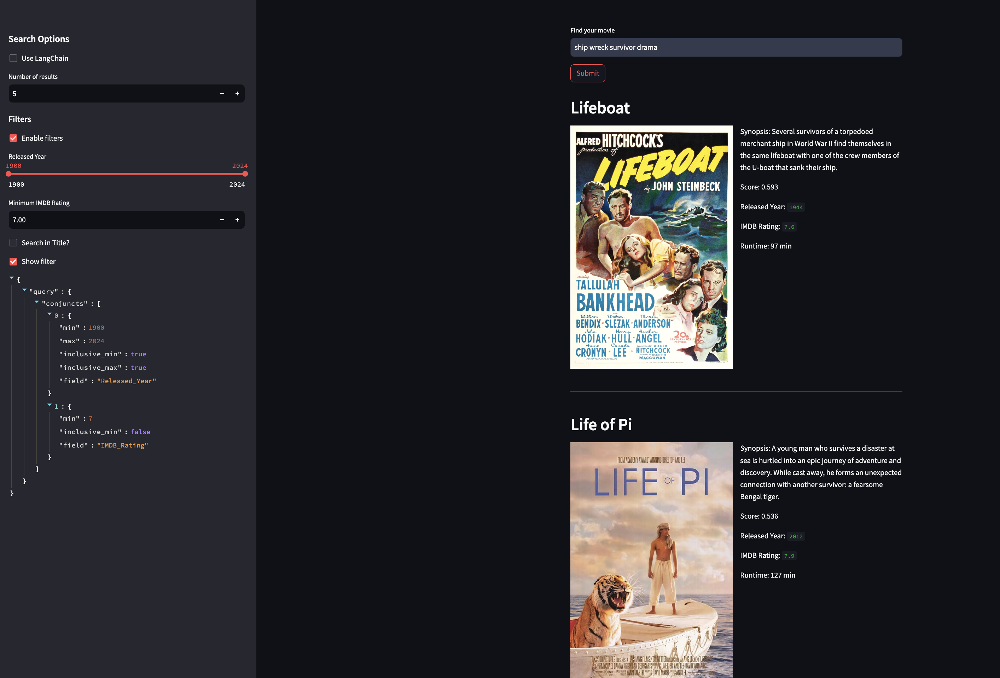

## Hybrid Movie Search using Couchbase

이 데모는 Couchbase의 벡터 검색 기능을 사용하여 영화 개요 또는 영화 개요를 기반으로 영화를 검색하는 기능을 제공합니다. [Couchbase Python SDK](https://docs.couchbase.com/python-sdk/current/howtos/full-text-searching-with-sdk.html)

> 벡터 검색을 위해서는 Couchbase Server 7.6 이상이 필요합니다.



### 설정

1. [Couchbase Capella](https://cloud.couchbase.com) 계정 생성
2. 새로운 Cluster 생성 (GCP 권장)
3. 새로운 Bucket 생성 (Bucket: `vectordemo`, Scope: `semantic`, Collection: `movie`)
  - Use system generated _default for scope and collection 체크
4. `.env`, `.streamlit/secrets.toml` 파일 생성 후 아래 환경 변수 설정
  ```
AZURE_OPENAI_API_KEY=<your azure openai api key>
AZURE_OPENAI_ENDPOINT=<https://yourname.openai.azure.com>
EMBEDDING_MODEL=text-embedding-3-small
DB_CONN_STR=couchbase://localhost
DB_USERNAME=Administrator
DB_PASSWORD=password
DB_BUCKET=travel-sample
DB_SCOPE=semantic
DB_COLLECTION=movie_azure
  ```
  - `AWS API, Bedrock 사용을 위한 권한 설정 및 환경 설정 필요
  - `couchbase_connection_string`은 Connect 탭에서 Public Connection String 복사
  - `couchbase_username` 및 `couchbase_password`는 Settings 탭 - Cluster Access 메뉴에서 생성 (All Buckets, All Scopes, Read/Write)
5. `requirements.txt`에 명시된 라이브러리 설치
  ```
  pip install -r requirements.txt
  ```
6. `ingest.py` 실행: Couchbase에 IMDB 데이터 저장
  ```
  python ingest.py
  ```
7. Data Tools - Search 탭에서 인덱스 생성
  - Advanced Mode 클릭
  - Import from File 클릭
  - `index.json` 파일 선택
  - Create Index 클릭
8. Streamlit 애플리케이션 실행
  ```
  streamlit run hybrid_search.py
  ```
---

### How does it work?

You can perform semantic searches for movies based on the plot synopsis. Additionally, you can filter the results based on the year of release and the IMDB rating for the movie. Optionally, you can also search for the keyword in the movie title.



The hybrid search can be performed using both the Couchbase Python SDK & the LangChain Vector Store integration for Couchbase. We use OpenAI for generating the embeddings.

### How to Run

- #### Install dependencies

  `pip install -r requirements.txt`

- #### Set the environment secrets

  Copy the `secrets.example.toml` file and rename it to `secrets.toml` and replace the placeholders with the actual values for your environment.

  > For the ingestion script, the same environment variables need to be set in the environment (using `.env` file from `.env.example`) as it runs outside the Streamlit environment.

  ```
  DB_CONN_STR = "<connection_string_for_couchbase_cluster>"
  DB_USERNAME = "<username_for_couchbase_cluster>"
  DB_PASSWORD = "<password_for_couchbase_cluster>"
  DB_BUCKET = "<name_of_bucket_to_store_documents>"
  DB_SCOPE = "<name_of_scope_to_store_documents>"
  DB_COLLECTION = "<name_of_collection_to_store_documents>"
  INDEX_NAME = "<name_of_search_index_with_vector_support>"
  EMBEDDING_MODEL = "amazon.titan-embed-text-v2:0" # Bedrock embedding model to use to encode the documents
  ```

- #### Create the Search Index on Full Text Service

  We need to create the Search Index on the Full Text Service in Couchbase. For this demo, you can import the following index using the instructions.

  - [Couchbase Capella](https://docs.couchbase.com/cloud/search/import-search-index.html)

    - Copy the index definition to a new file index.json
    - Import the file in Capella using the instructions in the documentation.
    - Click on Create Index to create the index.

  - [Couchbase Server](https://docs.couchbase.com/server/current/search/import-search-index.html)

    - Click on Search -> Add Index -> Import
    - Copy the following Index definition in the Import screen
    - Click on Create Index to create the index.

  #### Index Definition

  Here, we are creating the index `movies-search-demo` on the documents in the `_default` collection within the `_default` scope in the bucket `movies`. The Vector field is set to `Overview_embedding` with 1536 dimensions and the text field set to `Overview`. We are also indexing and storing some of the other fields in the document for the hybrid search. The similarity metric is set to `dot_product`. If there is a change in these parameters, please adapt the index accordingly.

  ```json
  {
    "type": "fulltext-index",
    "name": "movie_idx",
    "sourceType": "gocbcore",
    "sourceName": "vectordemo",
    "planParams": {
      "maxPartitionsPerPIndex": 64,
      "indexPartitions": 16
    },
    "params": {
      "doc_config": {
        "docid_prefix_delim": "",
        "docid_regexp": "",
        "mode": "scope.collection.type_field",
        "type_field": "type"
      },
      "mapping": {
        "analysis": {},
        "default_analyzer": "standard",
        "default_datetime_parser": "dateTimeOptional",
        "default_field": "_all",
        "default_mapping": {
          "dynamic": false,
          "enabled": false
        },
        "default_type": "_default",
        "docvalues_dynamic": false,
        "index_dynamic": false,
        "store_dynamic": false,
        "type_field": "_type",
        "types": {
          "semantic.movie": {
            "dynamic": false,
            "enabled": true,
            "properties": {
              "IMDB_Rating": {
                "dynamic": false,
                "enabled": true,
                "fields": [
                  {
                    "index": true,
                    "name": "IMDB_Rating",
                    "store": true,
                    "type": "number"
                  }
                ]
              },
              "Overview": {
                "dynamic": false,
                "enabled": true,
                "fields": [
                  {
                    "analyzer": "en",
                    "index": true,
                    "name": "Overview",
                    "store": true,
                    "type": "text"
                  }
                ]
              },
              "Overview_embedding": {
                "dynamic": false,
                "enabled": true,
                "fields": [
                  {
                    "dims": 1024,
                    "index": true,
                    "name": "Overview_embedding",
                    "similarity": "dot_product",
                    "type": "vector",
                    "vector_index_optimized_for": "recall"
                  }
                ]
              },
              "Poster_Link": {
                "dynamic": false,
                "enabled": true,
                "fields": [
                  {
                    "analyzer": "en",
                    "index": true,
                    "name": "Poster_Link",
                    "store": true,
                    "type": "text"
                  }
                ]
              },
              "Released_Year": {
                "dynamic": false,
                "enabled": true,
                "fields": [
                  {
                    "index": true,
                    "name": "Released_Year",
                    "store": true,
                    "type": "number"
                  }
                ]
              },
              "Runtime": {
                "dynamic": false,
                "enabled": true,
                "fields": [
                  {
                    "analyzer": "en",
                    "index": true,
                    "name": "Runtime",
                    "store": true,
                    "type": "text"
                  }
                ]
              },
              "Series_Title": {
                "dynamic": false,
                "enabled": true,
                "fields": [
                  {
                    "analyzer": "keyword",
                    "index": true,
                    "name": "Series_Title",
                    "store": true,
                    "type": "text"
                  }
                ]
              }
            }
          }
        }
      },
      "store": {
        "indexType": "scorch",
        "segmentVersion": 16
      }
    },
    "sourceParams": {}
  }
  ```

- #### Ingest the Documents

  For this demo, we are using the [IMDB dataset from Kaggle](https://www.kaggle.com/datasets/harshitshankhdhar/imdb-dataset-of-top-1000-movies-and-tv-shows). You can download the CSV file, `imdb_top_1000.csv` to the source folder or use the one provided in the repo.

  To ingest the documents including generating the embeddings for the Overview field, you can run the script, `ingest.py`

  `python ingest.py`

- #### Run the application

  `streamlit run hybrid_search.py`
